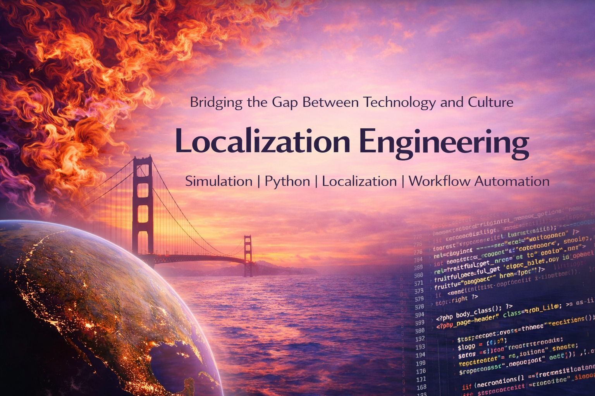

  

# Hi, I'm Juan Carlos!

I come from a technical background in Computational Fluid Dynamics (CFD) and numerical methods, where I worked directly with source code.

I am now transitioning into **Localization Engineering and Language Technology**, applying engineering principles to linguistic workflows.

Rather than treating localization as purely linguistic work, I approach it as a **systems problem** that involves:

- structured data modeling  
- reproducible pipelines  
- controlled content transformation  
- automation and tooling  

---

## Current Technical Focus

Alongside my studies in Translation & Interpreting, I am building structured Python projects to strengthen:

- JSON-based linguistic data modeling  
- pipeline design and build systems  
- content normalization and validation  
- clean CLI tooling  
- reproducible generation workflows  

I am particularly interested in:

- localization engineering  
- translation technology ecosystems  
- structured linguistic datasets  
- automation for language workflows  
- process design for multilingual systems  

---

## Why I Approach Language Work Technically

My career transition is not a move away from engineering —  
it is an intentional shift toward applying **engineering rigor to language systems**.

I am currently designing structured linguistic pipelines based on JSON-driven generation systems.

---

## LinkedIn: https://www.linkedin.com/in/juan-carlos-casava
