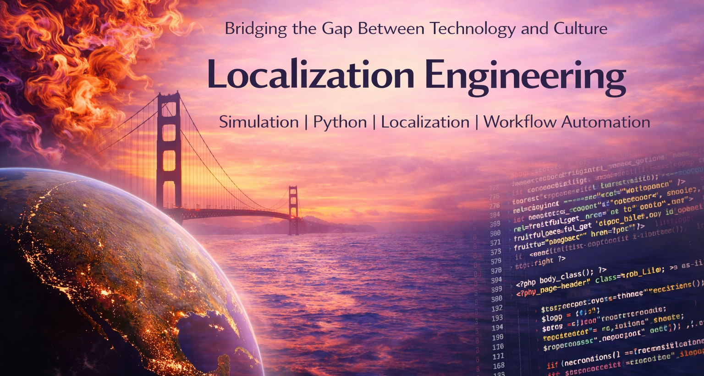
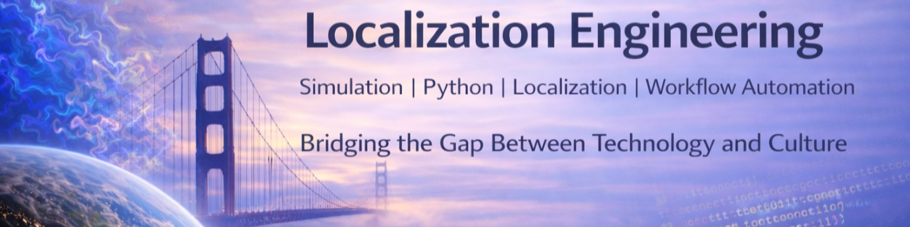

# Banner Design — Localization Engineering

## Author
Juan Carlos Castorena Avalos
Date: 2026-04-18

## Overview

This banner was created as part of my transition into Localization Engineering, combining engineering systems thinking with language and translation workflows.

Two versions are used for different platforms:

- GitHub profile (compact format)
- LinkedIn banner (full-width format)

## GitHub Version

## LinkedIn Version

## Design Concept

The composition combines:

- Earth from space → global systems and scale  
- Bridge imagery → connection between engineering and language  
- Code elements → software, automation, and technical workflows  

The visual direction prioritizes clarity, readability, and professional consistency over decorative or artificial effects.

## Design Decisions

The LinkedIn banner was refined to reduce visual noise and remove elements that could appear inconsistent or artificially generated.

This ensures a more credible and technically aligned presentation.

## Assets (external sources)

- Earth image  
  Photo by **Mara F**  
  https://unsplash.com/es/fotos/vista-de-la-tierra-desde-el-espacio-por-la-noche-tZdFQvqJuQQ

- Programming image  
  Photo by **Ilya Pavlov**  
  https://unsplash.com/es/fotos/monitor-showing-java-programming-OqtafYT5kTw

## License

Images sourced from Unsplash and used under the Unsplash License.

## Notes

All composition, editing, platform adaptation, and final design decisions were made by the author.
